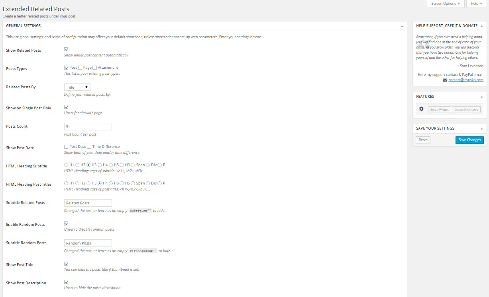
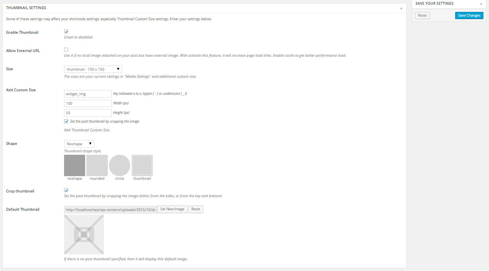
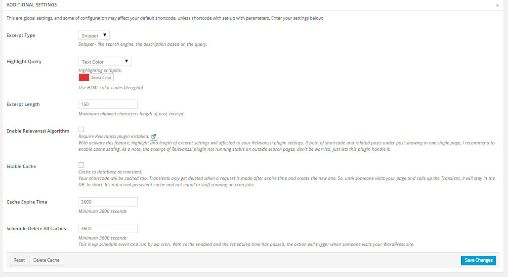
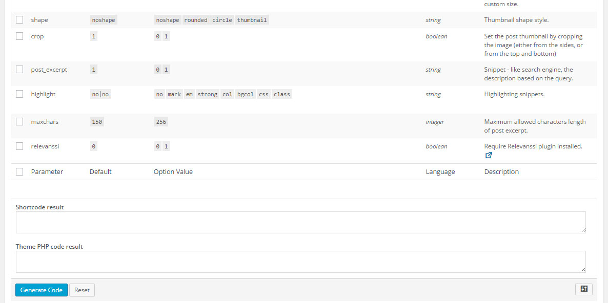
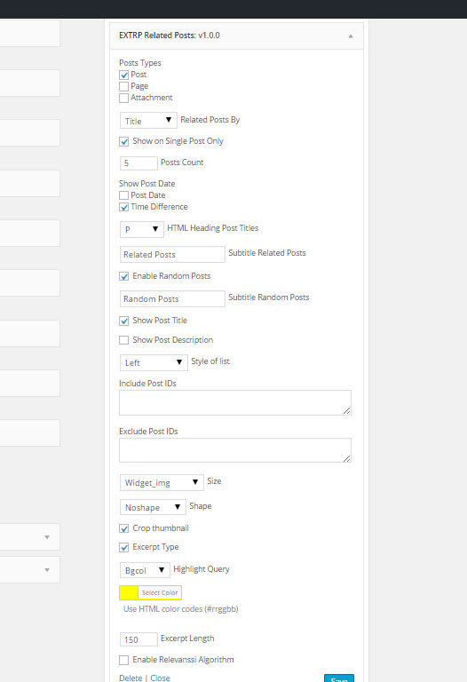

Create a better related posts more relevant under your post. Settings, shortcode and widget available.

## Description
Extended Related Posts plugin could be supported by [Relevanssi](https://wordpress.org/plugins/relevanssi/) plugin if you activate the feature in plugin administration area. Searching related posts by post title is default search algorithm of this plugin, as WordPress search default. And if no results by post title, it will continued get the related posts by their categories automatically, then by tags, and by split each post title words. If no more relevant posts, it will show your random posts. Abuse with any extension that you made is welcome to support this plugin. A bunch of features is available.

## Installation
1. Upload plugin zip contents to `wp-contents/plugin` directory and activate the plugin.
2. Go to `EXTRP Related Posts` > `Settings` and make some configuration if you need and save your work.
3. If you need to use relevanssi algorithm for relevant posts, you can enable Relevanssi Algorithm feature under plugin panel settings.
4. You can insert shortcodes and php code into administration posts area or direct to your theme. Widget for related post on sidebar is available.

## Frequently Asked Questions
#### How do I setup my WordPress theme to work with Extended Related Posts

You can use php code `<?php do_action('jv-related-posts'); ?>` and add this single line code after the_content code. Single or sitewide pages is welcome. More advance code is available.

## Screenshots
1. General Settings `extrp-general-settings.jpg`.

2. Thumbnail Settings `extrp-thumbnail-settings.jpg`.

3. Additional Settings `extrp-additional-settings.jpg`.

4. Shortcode Generator `extrp-shortcode-generator.jpg`.

5. Widget Settings `extrp-widget.jpg`.

## Changelog
* 1.0 = October 22, 2015
 * First official release!
 
## Upgrade Notice
* 1.0.0
 * This version is first release